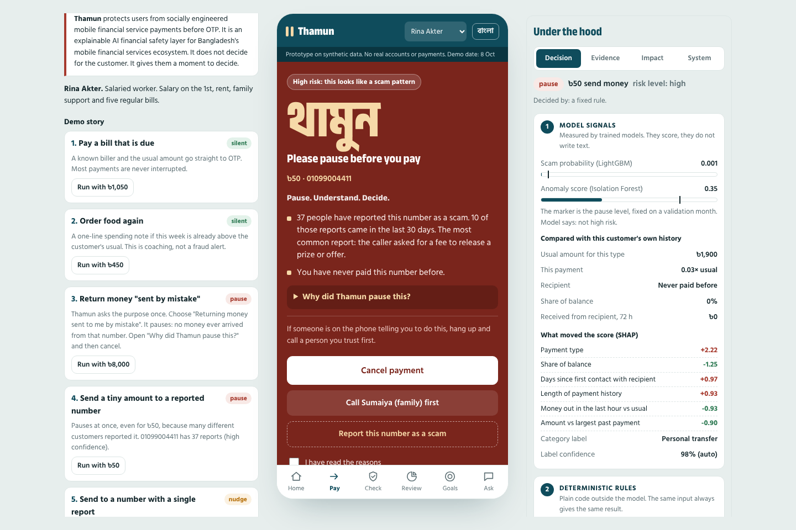
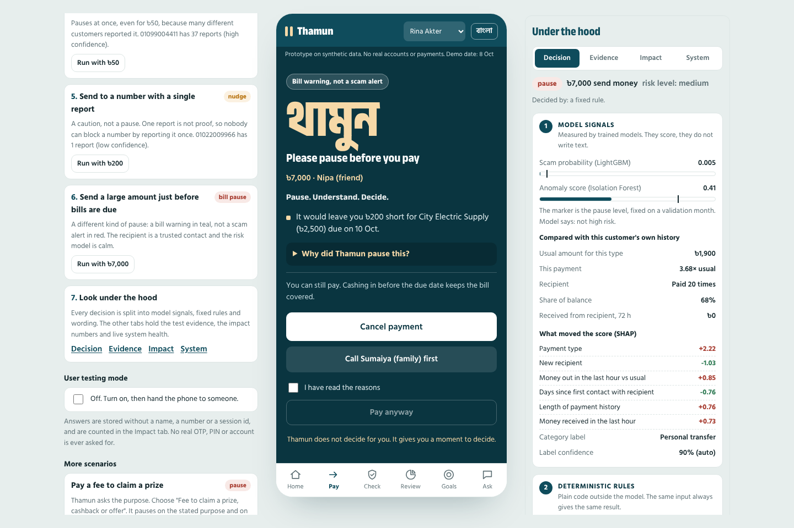
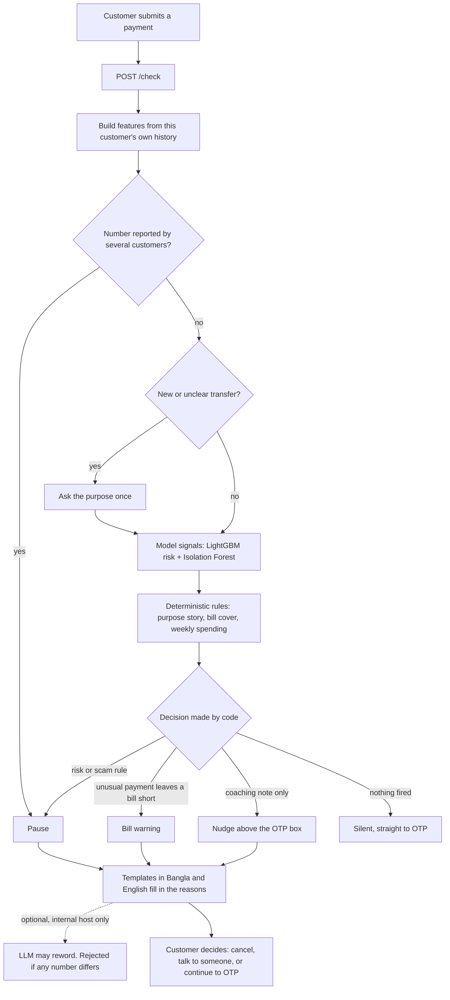
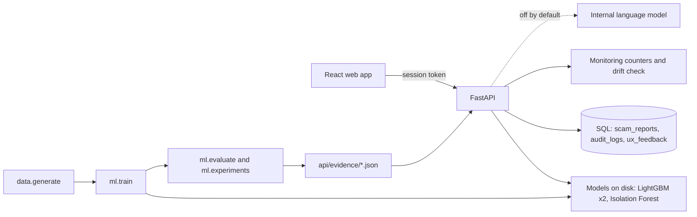

# Thamun

**Pause. Understand. Decide.**

Thamun (থামুন, Bangla for "please pause") protects users from socially engineered mobile financial
service payments **before OTP**. It is an explainable AI financial safety layer for Bangladesh's mobile
financial services ecosystem, with a money coach built on the same engine.

> Thamun doesn't decide for you. It gives you a moment to decide.

Built for the AI DEV FEST 2026 AI Hackathon (DIU CPC × upay), Track 01 Trust & Risk and Track 03
Financial Independence.

| | |
|---|---|
| Live app | https://thamun.vercel.app |
| Live API | `https://thamun-demo.onrender.com` (interactive docs at `/docs`) |
| Demo video | https://drive.google.com/file/d/1c6QW9KjVeQPvivgj_39NzZTq4E2FSBrW/view?usp=sharing |
| Team | Neural Nexus: Tammam Ibn Aman (232-15-755), Sachin Sarker (232-15-249), Deep Mitra (232-15-211) |
| Phase 2 changes | [What the judges said and what we changed](docs/judge_feedback_response.md) |

The first request can take up to a minute because the free API server sleeps when idle.


## 1. The problem

**In Bangladesh, the scammer no longer steals the password. They talk the customer into sending the
money.** A caller says "I sent you money by mistake, please return it", or "you won a prize, pay the
fee", or pretends to be a wallet agent. The customer opens their own app, types their own PIN and enters
their own OTP. To the wallet this is a normal, fully authorised payment, so login security and OTP do
nothing. This is called an authorised push payment (APP) scam.

Bangladesh Bank data reported by [The Financial Express](https://thefinancialexpress.com.bd/trade/fraudsters-gobble-up-tk-926m-in-2025)
(16 June 2026): payment fraud cost Tk 926.01 million in 2025 across 81,423 reported cases. Mobile
financial services made up about 88% of the value, and only 10.7% of the money was recovered.

**Problem statement.** A mobile wallet customer who is being manipulated has no protection at the one
moment that matters: after they have decided to pay and before the OTP. Once the OTP is entered the money
is almost never recovered. The wallet needs a way to notice that a payment does not fit the customer's
own behaviour or matches a known scam story, say so in plain Bangla or English, and still leave the
decision with the customer, without slowing down the nine in ten payments that are perfectly normal.

A second, quieter problem sits next to it: wallets show spending after the money is gone, and nothing
warns the customer that a bill is about to fail. The same engine that reads a customer's history for
risk can also do that.

## 2. What Thamun does

One engine checks every payment before the OTP step and answers in one of three ways.

| Response | When | What the customer sees |
|---|---|---|
| **Silent** | The payment looks like the customer's normal behaviour | Straight to OTP. No extra step |
| **Nudge** | A coaching note: a category is above the customer's usual week, a bill is close, or a number has one unconfirmed report | One line above the OTP box. Never blocks |
| **Pause** | Behaviour looks like a scam, the stated purpose is a known scam story, several customers have reported the number, or an unusual payment leaves a bill unpaid | A full screen with the top three reasons, an expandable "Why did Thamun pause this?", and three choices: cancel, talk to someone first, or continue anyway |

The customer always makes the final decision. Nothing is blocked automatically.

Thamun has two clearly separate jobs:

| | Protection | Money coach |
|---|---|---|
| Question it answers | "Is someone tricking me right now?" | "Will I have enough for my bills and my goal?" |
| Where it shows | Red pause page, Check tab, reported numbers | Teal bill warning, one-line nudges, Home cards, Review, Goals, Ask |
| Built from | Behaviour models, purpose rules, report reputation | Bill detection, cash-flow forecast, spending baseline, savings plan |

## 3. What changed after Phase 1

Full table with evidence: [docs/judge_feedback_response.md](docs/judge_feedback_response.md).

| Judge feedback | What we changed |
|---|---|
| Problem statement should be clearer | Rewritten around authorised push payment scams in Bangladesh (section 1), shown in the app |
| All data is synthetic, real performance unknown | Model comparison, ablation, calibration, a held-out scam type test, and a stress test on new populations with two assumptions changed against us. A validation roadmap states what is not yet measured |
| Business impact not addressed clearly | B2B2C business model, impact measures, an Impact tab that separates simulation, live demo use and real users |
| Innovation will impact the customer experience | Measured: 91.0% of payments are never interrupted. One report no longer pauses. Top three reasons only. Scam pauses and bill warnings look different |
| Demo or session-based data, in-memory report state | Reports, decision log and user-testing answers are in SQL tables (SQLite locally, PostgreSQL in deployment) |
| No large-scale testing or production monitoring | Locust load test with real results, a live System tab, a drift check and a retraining plan |
| Wallet data cannot cross borders, internally hosted AI recommended | The decision path uses no external service. The optional LLM is refused unless its host is internal |
| Better authentication and security needed | Signed session tokens, rate limiting, admin key, audit log, security headers, safe errors |

## 4. Features

**Protection**

| Feature | What it does | How |
|---|---|---|
| Pre-OTP guard | Scores every payment against the customer's own history: amount, recipient, time, pace, share of balance | LightGBM classifier plus Isolation Forest on per-customer deviation features |
| Purpose check | Asks "what is this for?" only for new or unclear transfers (2.7% of payments), then checks the answer against data. A "refund" with no matching incoming transfer is a scam signal | Fixed rules outside the model |
| Scam number reputation | Customers report numbers. Confidence comes from how many different customers reported a number and how recently. Low confidence adds a caution. Medium and high pause any amount | SQL table, one report per customer per number, recency weights, daily limits |
| Check a number | Look a number up before paying: reports, confidence, pattern, and your own history with it | Same reputation data |
| Reasons for every pause | Top three reasons in plain language, more under "Why did Thamun pause this?" with the real values | SHAP values from LightGBM, filtered so that only factually true statements are shown |

**Money coach**

| Feature | What it does | How |
|---|---|---|
| Bill readiness | Finds recurring bills, forecasts the balance to each due date, reminds three days early, and warns when an unusual payment would leave a bill short | Interval-based recurrence detection and a cash-flow forecast |
| Spending nudges | A one-line heads-up when a category runs above the customer's own usual week, at most two a week | Robust per-customer baseline, festival weeks excluded |
| Smart labels | Categorises payments and asks only when unsure | LightGBM multiclass classifier with a confidence threshold |
| Monthly review, goals, Ask Thamun | Where the month went, a weekly savings plan, plain answers about spending and bills | Aggregation and intent matching over computed facts |

**Trust and transparency**

| Feature | What it does |
|---|---|
| Decision panel | Splits each decision into model signals, deterministic rules and LLM explanation |
| Evidence, Impact and System tabs | Test results, impact measures by source, live monitoring and load test |
| User testing mode | Asks five short questions after each warning and stores anonymous answers |
| Bangla and English | Every customer-facing message in both languages |





## 5. How it works





More diagrams: [offline pipeline](docs/diagrams/2-offline-pipeline.png),
[the scam payment, call by call](docs/diagrams/4-scam-payment-sequence.png) and the production
architecture in [docs/architecture.md](docs/architecture.md).

## 6. AI and ML depth

All numbers in this section are produced by scripts in this repository on **synthetic data**:
`python -m ml.evaluate` and `python -m ml.experiments`. Full reports: [docs/evaluation.md](docs/evaluation.md)
and [docs/model_comparison.md](docs/model_comparison.md).

### Headline results

| Measure | Held-out month, same population | New populations the models never saw |
|---|---|---|
| Scam payments paused before OTP | 96.3% of 54 (95% interval 87.5% to 99.0%) | 92.1% of 190 (95% interval 87.4% to 95.2%) |
| False pauses per customer per month | 0.58 | 0.66 |

The second column is the more honest one. It is lower, and it is still inside one simulator.

### Why LightGBM

Same features, same time split, and each model allowed exactly the same number of false pauses in the
test month.

| Model | PR-AUC | Scam payments caught | Time per payment | Size |
|---|---|---|---|---|
| Logistic regression | 0.567 | 45 of 54 | 3.5 ms | 5 KB |
| Random forest | 0.697 | 52 of 54 | 57.1 ms | 8302 KB |
| LightGBM | 0.719 | 53 of 54 | 0.3 ms | 314 KB |
| Isolation Forest | 0.012 | 1 of 54 | 8.7 ms | 3446 KB |

- Logistic regression is clearly behind: the signal is in interactions (a new recipient **and** an unusual
  amount **and** a large share of balance) that a linear model cannot express.
- Random Forest and LightGBM are within one payment of each other, which is inside the noise for
  54 scam payments. LightGBM is used because it is far faster per payment, far smaller, and gives
  exact SHAP values for the reasons.
- **Honest finding:** inside the combined model the Isolation Forest added 0 scam payments and
  23 false pauses, and it is the slowest part of a check. It stays switched on so that the
  decision behaviour is unchanged on the final day, and it is marked for shadow mode in the
  [validation roadmap](docs/validation_roadmap.md).

### Which signals carry the result (ablation)

Scam payments caught by LightGBM when one group of features is removed. The full model catches
53 of 54. With only the raw payment fields (amount, payment type, recipient type) and no
customer history it catches 0.

| Feature group removed | Scam payments caught | Change |
|---|---|---|
| Amount compared with the customer's own history | 52 of 54 | -1 |
| Recipient history | 34 of 54 | -19 |
| Share of balance | 46 of 54 | -7 |
| Time of day | 48 of 54 | -5 |
| Speed and sequence in the last hour and day | 46 of 54 | -7 |

The value comes from comparing each customer with their own past, and most of all from recipient history.

### What each decision layer adds

| Layer | Scam payments paused | Genuine payments paused per customer per month |
|---|---|---|
| Purpose rules alone | 30 of 54 | 0.00 |
| Behaviour model alone (LightGBM + Isolation Forest) | 52 of 54 | 0.58 |
| Behaviour model + purpose rules | 52 of 54 | 0.58 |
| + bill-risk pause (full Thamun decision) | 52 of 54 | 0.87 |

Purpose rules alone catch 30 scam payments with no false pauses, but only when the customer
tells the truth about the purpose. On new populations they add several points on top of the model (see
the stress test). Scam-number reputation is **not measured**: every simulated scam uses a number once,
so a report list cannot help by construction.

### Stress test: what if the simulator is wrong?

Models and thresholds are frozen. New populations are generated and scored. Nothing is retrained.

| Population | Scam payments paused | Recall | False pauses per customer per month |
|---|---|---|---|
| New customers (seed 7) | 49 of 53 | 92.5% | 0.68 |
| New customers (seed 101) | 66 of 74 | 89.2% | 0.69 |
| New customers (seed 2026) | 60 of 63 | 95.2% | 0.61 |
| Scammers ask for ordinary amounts (70% of scams, was 30%) | 50 of 53 | 94.3% | 0.69 |
| Victims coached to hide the purpose (honesty x 0.3) | 54 of 59 | 91.5% | 0.70 |
| Both shifts together | 55 of 61 | 90.2% | 0.66 |

Also measured: when each scam type is hidden from training in turn, 85.2% of those payments are
still caught, because the features describe behaviour and not a scam script. Impersonation through a
known contact's account stays the blind spot. The scam probability is calibrated with isotonic
regression for reporting (Brier score 0.00352 raw, 0.00299 calibrated). Decisions use the
ranking, so calibration changes no decision.

### Other results on the held-out month

| Measure | Result |
|---|---|
| Scam incidents paused at the first payment | 94.9% of 39 |
| Scam money paused | 88.9% |
| Category accuracy, and accuracy of auto-labels | 96.2% and 97.1% |
| Recurring bills found | 98.9%, with due dates off by 0.35 days on average |
| Bill shortfalls flagged three days ahead | 74.6% found, 56.5% of flags correct |
| Spending nudges per customer per month | 1.45, with 89.0% in weeks truly above the customer's usual |

Fairness check. Persona is never a model input:

| Persona | Scam payments paused | False pauses per customer per month |
|---|---|---|
| Irregular | 100.0% of 19 | 0.25 |
| Salaried | 95.2% of 21 | 0.66 |
| Shop owner | 85.7% of 7 | 0.67 |
| Student | 100.0% of 7 | 0.64 |

## 7. Explainability and the LLM boundary

The Decision tab shows every decision in three separate parts.

| Part | What is in it | Can it change the decision? |
|---|---|---|
| **Model signals** | LightGBM scam probability against its threshold, Isolation Forest anomaly score, SHAP contributions, the customer's own usual values | Yes. This is one of the two inputs |
| **Deterministic rules** | Purpose rules, report confidence, bill cover, weekly spending baseline | Yes. This is the other input |
| **LLM explanation** | Whether the wording came from a template or a language model | **No. Never** |

- The decision is made by plain code from the first two parts.
- Messages come from templates in Bangla and English. A language model may only reword a finished
  message. Its output is discarded unless it contains exactly the same numbers as the template, no link,
  and is short. For "Ask Thamun" an answer containing any number that is not in the computed facts is
  discarded.
- With no language model the app works fully. The live demo runs without one.
- Reasons are shown only when they are factually true for this payment, in a fixed order.

## 8. Customer experience and alert fatigue

Phase 1 feedback: "Innovation is good but it will impact the customer experience." Measured on the
held-out month:

| Measure | Result |
|---|---|
| Payments that go straight to OTP with no question and no message | 91.0% |
| Payments where the purpose is asked | 2.7% |
| Payments with a one-line nudge | 5.3% |
| Payments paused (includes the injected scams) | 2.5% |
| Genuine payments paused | 1.9% |
| False pauses per customer per month | 0.58 |

Design choices that keep the friction low:

- Silent is the default. The purpose question appears only for new or unclear transfers.
- A pause shows the top three reasons. The rest is behind one tap.
- One report against a number is a caution, not a pause, so a single person cannot make a number
  alarming for everyone.
- Spending nudges are capped at two a week and one per category per week.
- A bill warning is teal and says "Bill warning, not a scam alert". A scam pause is red.
- Every pause has the same three exits: cancel, talk to someone first, continue anyway.

## 9. Privacy and data residency

Details: [docs/privacy_security.md](docs/privacy_security.md).

- The whole decision path (models, rules, explanations) runs inside the API process on ordinary CPUs.
  It calls no external service, so a wallet provider can run it on its own servers in Bangladesh.
- The optional language model is off by default. With `LLM_DATA_RESIDENCY=internal_only` (the default) a
  public LLM address is refused and templates are used. In production the model would be hosted inside
  the provider's data centre.
- The decision log never stores the recipient's number. Reporter identities are keyed hashes and are
  never returned by the API. User-testing answers are stored without a name or number.
- The prototype uses synthetic customers only and never asks for a real login, PIN or OTP.

## 10. Security

| Control | Status |
|---|---|
| Session tokens (signed, 12 hours). Data routes return 401 without one | Implemented |
| A token can be bound to one customer (403 for another) | Implemented, left open in the demo so judges can switch customer |
| Rate limiting per session and per address, 429 with `Retry-After` | Implemented, in memory |
| Admin key for raw exports and the audit log | Implemented |
| Request validation on every route, length limits on free text | Implemented |
| Security headers, generic error messages, restricted CORS | Implemented |
| Report abuse limits: one per customer per number, five a day, confidence from distinct reporters | Implemented |
| Real customer login, shared rate limiter, secrets manager, penetration test | Needed for production. Not done |

## 11. Scalability and monitoring

Details: [docs/architecture.md](docs/architecture.md).

Locust load test (`python -m loadtest.run`), one API worker on a 2-core machine that also ran
the load generator: at **50 simultaneous users** the API served **77.0 requests a second
with no failed requests**, and the risk check took 41 ms at the median, 300 ms at the 95th
percentile and 480 ms at the 99th. Beyond that one worker queues: the full table, including the
stages where it saturates, is in the architecture document. Scaling out with more workers is the design
intent and has not been measured.

The System tab shows live requests, error rate, risk-check latency, decision mix, score drift against the
test month, database health and security settings. The architecture document holds the production
design, the database schema and the drift and retraining plan.

## 12. Business model

Details: [docs/business_model.md](docs/business_model.md).

Thamun is sold to wallet providers and is free for their customers (B2B2C). The provider pays because an
authorised scam costs it a complaint to handle, money that is almost never recovered, and often the
customer. The customer never pays, sees no advertising and is never offered a loan. Impact would be
measured against a control group: scam loss per 1,000 customers, complaints per 1,000 pauses, bills paid
on time, balance kept in the wallet and 90-day retention. None of these has been measured yet.

## 13. Validation roadmap and user testing

Details: [docs/validation_roadmap.md](docs/validation_roadmap.md).

1. Simulation, ablation and stress test (done, synthetic).
2. Offline replay on anonymised history inside the provider's environment.
3. Shadow mode on live payments, nothing shown to customers.
4. Pilot with a control group.
5. Rollout with drift monitoring.

User testing mode is built into the app. Answers are counted live in the Impact tab and can be exported.
This repository claims no user-testing result.

## 14. Limitations

- **All training and test data is synthetic**, from one simulator written by the team. Performance on real
  customers is not yet measured.
- Scam attempts are injected far more often than in real life, so precision would be lower in production.
  False pauses per customer per month do not depend on that rate.
- The held-out month has 54 scam payments. One payment moves recall by about two points.
- A scam sent through a known contact's hijacked account looks like a normal transfer to a friend.
- Report confidence levels are starting values, not tuned on real reuse of scam numbers.
- Customer history in the demo is a sandbox copy per browser session, held in memory. The rate limiter and
  monitoring counters are also in memory.
- The load test is one worker on one small machine.
- The demo has no real login. A session token identifies a browser session, not a person.

## 15. Technology stack

| Layer | Technology |
|---|---|
| Data | Python, NumPy, Pandas. Synthetic generator with a fixed seed |
| ML | LightGBM (label classifier, risk classifier, TreeSHAP), scikit-learn (Isolation Forest, baselines, calibration) |
| GenAI | Optional. Any OpenAI-compatible chat completions API on an internal host |
| API | FastAPI, Pydantic, Uvicorn, PyJWT |
| Database | SQLAlchemy Core. SQLite by default, PostgreSQL through `DATABASE_URL` (pg8000 driver) |
| Frontend | React 19, Vite, plain CSS, self-hosted Anek Bangla and Hind Siliguri fonts |
| Tests and load | pytest, FastAPI TestClient, Locust |
| Hosting | Render (API, PostgreSQL), Vercel (web app) |

## 16. Installation and setup

Requirements: Python 3.10 or newer, Node.js 20 or newer, about 1 GB of disk. No GPU.

```bash
git clone https://github.com/tammam321go/thamun.git
cd thamun

python3 -m venv .venv
source .venv/bin/activate
pip install --upgrade pip
pip install -r api/requirements.txt

cp .env.example .env

python -m data.generate      # about 15 seconds, writes data/out/
python -m ml.train           # about 25 seconds, writes ml/models/
python -m ml.evaluate        # about 15 seconds, writes docs/evaluation.md and api/evidence/metrics.json
python -m ml.experiments     # about 2 minutes, writes docs/model_comparison.md and api/evidence/experiments.json

cd web
cp .env.example .env.local
npm install
cd ..
```

Run:

```bash
# terminal 1, from the project root
source .venv/bin/activate
uvicorn api.main:app --reload --port 8000      # API at http://localhost:8000, docs at /docs

# terminal 2
cd web
npm run dev                                    # app at http://localhost:5173
```

Optional:

```bash
python -m loadtest.run --users 25,50,100 --seconds 40   # needs: pip install locust, and the API running
python -m data.generate --demo                          # rebuild the four demo customers
```

## 17. Environment variables

API, in `.env` at the project root:

| Variable | Purpose | Default |
|---|---|---|
| `ALLOWED_ORIGINS` | Web origins allowed to call the API | `*` (set the exact app address in deployment) |
| `THAMUN_SECRET` | Signs session tokens and hashes session and reporter ids | Random on each start, with a warning |
| `ADMIN_KEY` | Opens `/admin/feedback/export` and `/admin/audit` (header `X-Admin-Key`) | Empty: admin routes closed |
| `AUTH_REQUIRED` | `true`: data routes need a session token | `true` |
| `RATE_LIMIT_PER_MINUTE` | Requests a minute for one session or address | `240` |
| `DATABASE_URL` | PostgreSQL address. Empty uses a SQLite file at `data/thamun.db` | Empty |
| `LLM_DATA_RESIDENCY` | `internal_only` or `allow_external` | `internal_only` |
| `LLM_INTERNAL_HOSTS` | Extra host names that count as internal | Empty |
| `LLM_API_KEY`, `LLM_MODEL`, `LLM_BASE_URL`, `LLM_TIMEOUT` | Optional language model for rewording | Empty: templates only |

Web app, in `web/.env.local`: `VITE_API_URL`, the address of the API.

Never commit `.env` or `.env.local`. Both are in `.gitignore`.

## 18. Deployment

**API on Render**

1. New, Web Service, connect the repository. Language Python 3, instance type Free.
   - Build command: `pip install -r api/requirements.txt && python -m data.generate && python -m ml.train && python -m ml.evaluate`
   - Start command: `uvicorn api.main:app --host 0.0.0.0 --port $PORT`
   - Health check path: `/health`
2. New, PostgreSQL, free plan. Copy its Internal Database URL into `DATABASE_URL` on the web service.
   Without it the API uses SQLite, and Render's free disk is cleared on every restart. If PostgreSQL
   cannot be reached at start, the API logs the error and falls back to SQLite so the demo stays up.
   `/health` then shows `"database_fallback": true`.
3. Set `THAMUN_SECRET`, `ADMIN_KEY` and `ALLOWED_ORIGINS` (the Vercel address).
4. Deploy, then open `/health`. It reports the version, the database backend and whether tokens are required.

`render.yaml` describes the same setup as a Blueprint.

**Web app on Vercel**: import the repository, set Root Directory to `web`, add `VITE_API_URL` with the
Render address and deploy.

## 19. Testing

```bash
source .venv/bin/activate
python -m pytest -q
```

44 tests cover the purpose rules, decision logic, report reputation and abuse limits, database
persistence across a restart, the PostgreSQL fallback, the audit log, tokens (signature, expiry, customer binding), rate limiting,
admin routes, security headers and safe errors, the LLM guard (numbers, links, data residency), bill
detection and forecast, features, the nudge baseline, both languages, input validation, session
isolation, feedback and analytics, the evidence files, and the full demo story through the API.

Manual check as Rina Akter, the default customer. The Demo guide panel runs each step:

| Step | Do this | Expect |
|---|---|---|
| 1 | Pay the FiberLink Internet bill, ৳1,050 | Silent. Straight to OTP. Enter any 4 digits |
| 2 | Order food, ৳450 | A one-line note: eating out is above her usual week |
| 3 | Send ৳8,000 to a new number, choose "Returning money sent to me by mistake" | Red pause. Three reasons, more under "Why did Thamun pause this?". Cancel it |
| 4 | Send ৳50 to 01099004411 | Red pause at once, no purpose question. 37 customers reported the number |
| 5 | Send ৳200 to 01022009966 | A caution above the OTP box, not a pause. One report is not confirmation |
| 6 | Run "Send a large amount just before bills are due" (about ৳7,000 to Nipa, a friend). If asked the purpose, choose "Paying or lending to a friend" | Teal bill warning: it would leave the electricity bill short |
| 7 | Open the Decision, Evidence, Impact and System tabs | Model signals, rules and wording kept apart. Test evidence. Impact by source. Live health |
| 8 | Check tab: report 01012345678 as three different customers | Confidence goes from unconfirmed to likely scam. A fourth customer is now paused |

Switch the customer at the top of the phone to try a student, a shop owner and an irregular earner.
Switch the language with the button beside it. "Reset the demo" restores the start.

## 20. Project structure

```
thamun/
├── data/
│   ├── personas.py          personas, scam scenarios, stress-test settings
│   └── generate.py          synthetic data generator
├── ml/
│   ├── features.py          per-customer features, shared by training and the API
│   ├── categorizer.py       label model
│   ├── risk.py              risk model, isolation forest, SHAP reasons
│   ├── bills.py, nudges.py, goals.py, review.py, profile.py
│   ├── train.py             fits and saves the models
│   ├── evaluate.py          replays the test month through the engine
│   └── experiments.py       model comparison, calibration, ablation, stress test
├── api/
│   ├── main.py              routes
│   ├── engine.py            silent, nudge or pause
│   ├── reports.py           scam number reputation
│   ├── db.py                SQL tables (SQLite or PostgreSQL)
│   ├── security.py          session tokens, rate limiter, admin key
│   ├── monitor.py           live counters and drift check
│   ├── explain.py           Bangla and English templates, LLM guard
│   ├── schemas.py           request validation
│   ├── store.py             demo sandbox sessions
│   ├── evidence/            evaluation, experiment and load test results (JSON)
│   └── demo_data/           the four demo customers and the dummy report list
├── loadtest/                Locust scenario and runner
├── web/                     React app
├── tests/
└── docs/                    feedback response, architecture, privacy and security, business model,
                             validation roadmap, evaluation, model comparison, data assumptions, demo script
```

## Disclosures

- **Data.** All data is synthetic and generated by this repository. Every assumption is listed in
  [docs/data_assumptions.md](docs/data_assumptions.md). The five reported numbers are a dummy list.
- **External components.** LightGBM, scikit-learn, Pandas, NumPy, FastAPI, Pydantic, Uvicorn, httpx,
  SQLAlchemy, pg8000, PyJWT, Locust, React and Vite, plus the Anek Bangla and Hind Siliguri fonts (SIL
  Open Font License) through Fontsource.
- **AI tools.** AI coding assistance (Claude by Anthropic) was used during development, as the general
  rules allow. The team is responsible for all submitted code and can explain every part of it.
- **Figures in the problem statement.** Bangladesh Bank data as reported by The Financial Express,
  "Fraudsters gobble up Tk 926m in 2025", 16 June 2026.
