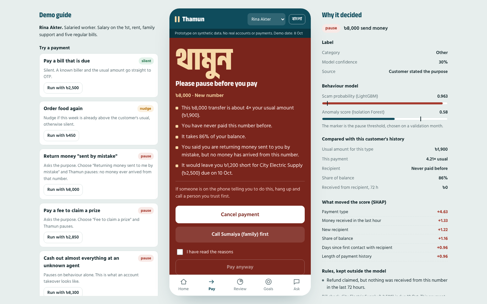
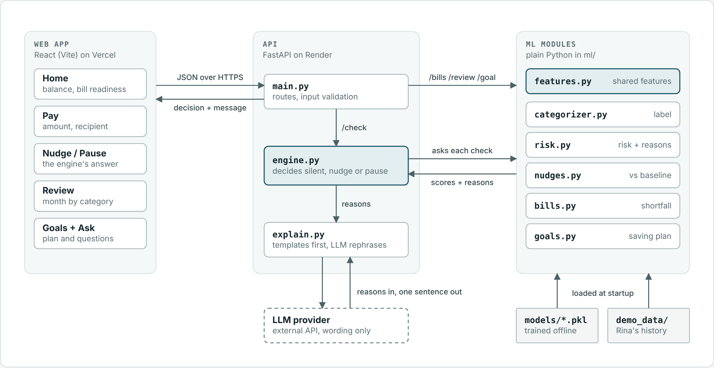
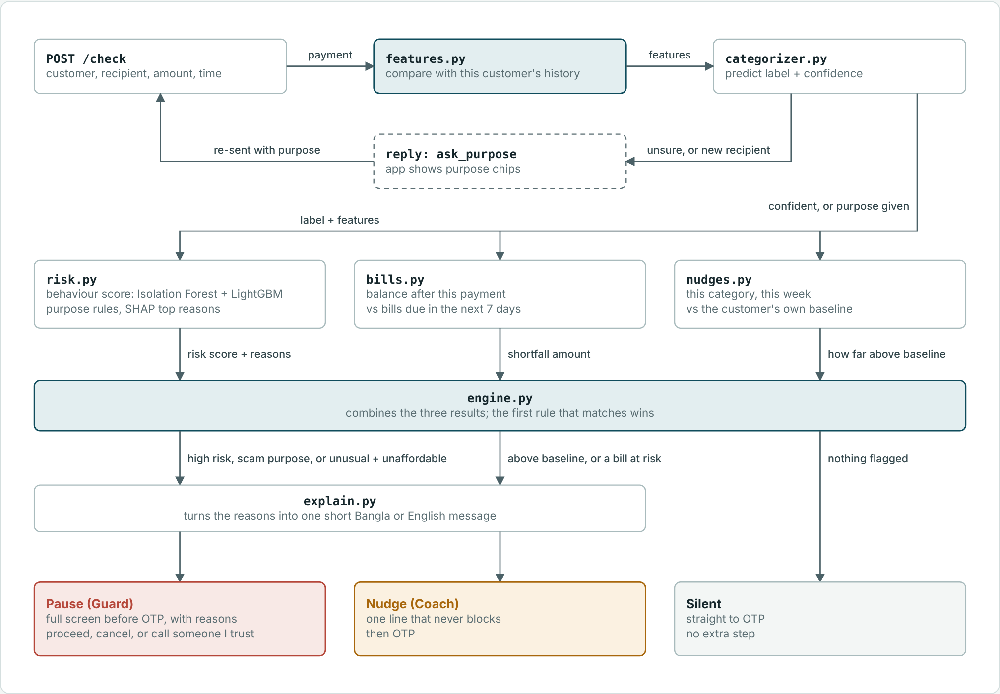

# Thamun

**Guard before you pay. Coach as you spend.**

"Thamun" (থামুন) is Bangla for "please pause". It is an AI money guardian and coach for mobile wallet
customers, built for the AI DEV FEST 2026 AI Hackathon (DIU CPC × upay), Track 01 Trust & Risk and
Track 03 Financial Independence.

| | |
|---|---|
| Live app | `https://YOUR-APP.vercel.app` |
| Live API | `https://YOUR-API.onrender.com` (interactive docs at `/docs`) |
| Demo video | `ADD LINK` |
| Project report | `ADD LINK` |
| Team | `TEAM NAME, MEMBER NAMES` |

The first request can take up to a minute because the free API server sleeps when idle.



## 1. Project overview

**Problem.** Payment fraud cost Bangladesh ৳926 million in 2025. Mobile financial services made up about
88% of it and only 10.7% was recovered. In most of these cases the real owner is talked into paying, so
the OTP is entered by the right person and cannot help. Separately, wallets show spending after the
money is gone, but nothing speaks up at the moment of paying or warns that a bill is about to fail.

**Problem statement.** For upay customers, scam-induced payments, unplanned overspending and missed bills
cause unrecoverable losses, month-end shortfalls and lost trust in the wallet. Thamun uses each
customer's own transaction history, upcoming bills and stated payment purposes to pause risky payments
before OTP and coach everyday spending, with success measured by scam payments caught at a low
false-pause rate, bill shortfalls flagged in advance and customers reaching the goals they set.

**Solution.** One engine checks every payment before the OTP and answers in one of three ways:

| Response | When | What the customer sees |
|---|---|---|
| Silent | The payment looks like the customer's normal behaviour | Straight to OTP, no extra step |
| Nudge (Coach) | Spending in a category is above the customer's usual week, or a bill is at risk | One line that never blocks |
| Pause (Guard) | Behaviour looks like a scam, the stated purpose is a known scam story, or an unusual payment leaves a bill unpaid | A full screen with the reasons. Cancel, call someone you trust, or pay anyway |

The customer always makes the final decision. Nothing is blocked automatically.

**Purpose.** Give upay a reason to be someone's main wallet: the wallet that protects you and helps you
plan. The measures that matter to the business are scam losses per customer, bills paid on time through
the wallet, balance kept in the wallet and retention.

## 2. Features

| Feature | What it does | AI component |
|---|---|---|
| Pre-OTP guard | Scores every payment against the customer's own history: amount, recipient, time, pace, share of balance | LightGBM classifier plus Isolation Forest on per-customer deviation features |
| Reasons for every pause | Shows the top reasons in plain language | SHAP values (TreeSHAP from LightGBM), filtered so that only statements that are factually true are shown |
| Purpose check | Asks "what is this for?" only for new or unclear transfers, then checks the answer against data. A "refund" with no matching incoming transfer is a scam signal | Business rules, kept outside the model |
| Smart labels | Categorises payments automatically and asks only when unsure. Customers can add their own labels | LightGBM multiclass classifier with a confidence threshold |
| Spending nudges | A one-line heads-up when a category runs above the customer's own usual week, at most two a week | Robust per-customer baseline (median and spread of recent comparable weeks, festival weeks excluded) |
| Bill readiness | Finds recurring bills, forecasts the balance to each due date and reminds the customer to cash in three days early | Interval-based recurrence detection and a cash-flow forecast |
| Monthly review | Category breakdown, change against last month, cash-flow pattern | Aggregation over labelled transactions |
| Goals | Turns "save ৳30,000 in six months" into a monthly and weekly plan and shows where it could come from | Plan derived from the customer's own flexible spending |
| Ask Thamun | Answers questions like "Why do I run short before month-end?" | Intent matching over computed facts, optionally worded by an LLM |
| Bangla and English | Every alert, reason and answer in both languages | Templates first, optional LLM rephrasing |
| Decision inspector | Shows judges the label, scores, SHAP contributions and rules behind each decision | Traceability layer |

The LLM is optional and only words messages. It receives reasons that are already computed, its output is
rejected if any number changes, and it cannot alter a score or a decision. With no LLM key the app works
fully on templates.

### How the blocks fit together




More diagrams: [offline pipeline](docs/diagrams/2-offline-pipeline.png) and
[the scam payment, call by call](docs/diagrams/4-scam-payment-sequence.png).

## 3. Technology stack

| Layer | Technology |
|---|---|
| Data | Python, NumPy, Pandas. Synthetic generator with a fixed seed |
| ML | LightGBM (label classifier, risk classifier, TreeSHAP), scikit-learn (Isolation Forest) |
| GenAI | Optional. Any OpenAI-compatible chat completions API, called over HTTPS with httpx |
| API | FastAPI, Pydantic, Uvicorn |
| Frontend | React 19, Vite, plain CSS, self-hosted Anek Bangla and Hind Siliguri fonts |
| Tests | pytest, FastAPI TestClient |
| Hosting | Render (API), Vercel (web app) |

## 4. Requirements

- Ubuntu 22.04 or newer (any OS with the tools below works)
- Python 3.10 or newer, with `venv`
- Node.js 20 or newer and npm
- About 1 GB of free disk space and 2 GB of RAM
- No GPU. Training takes under a minute on a laptop
- Optional: an API key for an OpenAI-compatible LLM

## 5. Installation and setup

```bash
# system packages
sudo apt update
sudo apt install -y git curl build-essential python3 python3-venv python3-pip libgomp1

# Node.js through nvm
curl -o- https://raw.githubusercontent.com/nvm-sh/nvm/v0.40.1/install.sh | bash
source ~/.bashrc
nvm install --lts

# the project
git clone https://github.com/YOUR-USERNAME/thamun.git
cd thamun

# Python environment and libraries
python3 -m venv .venv
source .venv/bin/activate
pip install --upgrade pip
pip install -r api/requirements.txt

# configuration
cp .env.example .env

# data and models
python -m data.generate      # about 15 seconds, writes data/out/
python -m ml.train           # about 20 seconds, writes ml/models/
python -m ml.evaluate        # about 15 seconds, writes ml/models/metrics.json and docs/evaluation.md

# web app
cd web
cp .env.example .env.local
npm install
cd ..
```

## 6. Environment variables

API, in `.env` at the project root:

| Variable | Purpose | Example |
|---|---|---|
| `ALLOWED_ORIGINS` | Comma-separated web origins allowed to call the API. `*` allows all | `https://your-app.vercel.app` |
| `LLM_API_KEY` | Optional. Key for an OpenAI-compatible LLM. Leave empty to use templates only | `your_key_here` |
| `LLM_MODEL` | Optional. Model name at that provider | `your_model_name` |
| `LLM_BASE_URL` | Optional. Base URL of the provider's OpenAI-compatible API | `https://api.openai.com/v1` |
| `LLM_TIMEOUT` | Optional. Seconds to wait before falling back to the template | `6` |

Web app, in `web/.env.local`:

| Variable | Purpose | Example |
|---|---|---|
| `VITE_API_URL` | Address of the API. Read at build time | `http://localhost:8000` |

Never commit `.env` or `.env.local`. Both are in `.gitignore`.

## 7. Run and build commands

```bash
# terminal 1, from the project root
source .venv/bin/activate
uvicorn api.main:app --reload --port 8000      # API at http://localhost:8000, docs at /docs

# terminal 2
cd web
npm run dev                                    # app at http://localhost:5173

# production build of the web app
cd web
npm run build                                  # output in web/dist
npm run preview                                # serve the build locally
```

Other commands:

```bash
python -m data.generate --demo    # also rebuild the four demo customers in api/demo_data
python -m data.generate --scale 2 # twice as many customers
```

## 8. Live deployment URL

- App: `https://YOUR-APP.vercel.app`
- API: `https://YOUR-API.onrender.com`

### Deploying the API on Render

1. Push the repository to GitHub.
2. In Render choose New, then Web Service, and connect the repository.
3. Settings: language Python 3, root directory empty, instance type Free.
   - Build command: `pip install -r api/requirements.txt && python -m data.generate && python -m ml.train && python -m ml.evaluate`
   - Start command: `uvicorn api.main:app --host 0.0.0.0 --port $PORT`
   - Health check path: `/health`
4. Add the environment variables from section 6. The Python version comes from the `.python-version` file.
5. Deploy, then open `https://YOUR-API.onrender.com/health`.

`render.yaml` contains the same settings for a one-step Blueprint deploy.

### Deploying the web app on Vercel

1. In Vercel choose Add New, then Project, and import the same repository.
2. Set Root Directory to `web`. Vercel detects Vite.
3. Add the environment variable `VITE_API_URL` with the Render URL, without a trailing slash.
4. Deploy. Then set `ALLOWED_ORIGINS` on Render to the Vercel URL and redeploy the API.

## 9. Testing instructions

Automated tests:

```bash
source .venv/bin/activate
python -m pytest -q
```

21 tests cover the purpose rules, the decision logic, bill detection and forecast, the features, the
nudge baseline, both languages, the LLM guard, input validation, session isolation and the full demo
story through the API.

Manual check, as Rina Akter (the default customer). The Demo guide panel in the app runs each step:

| Step | Do this | Expect |
|---|---|---|
| 1 | Pay the FiberLink Internet bill, ৳1,050 | Silent. Straight to OTP. Enter any 4 digits. Balance ৳9,750 |
| 2 | Order food, ৳450 | Nudge: "this is your 5th eating out payment this week. Eating out is at ৳2,100, about 37% above your usual week (৳1,538)". Balance ৳9,300 |
| 3 | Send ৳8,000 to a new number | Thamun asks what it is for. Choose "Returning money sent to me by mistake" |
| | | Pause with five reasons: about 4× the usual amount, a number never paid before, 86% of the balance, no money ever arrived from that number, and ৳1,200 short for City Electric Supply due on 10 Oct. Cancel it |
| 4 | Open Home | Bills with ready, tight and short status and a cash-in reminder three days ahead |
| 5 | Open Review, Goals and Ask | September by category, a plan for ৳30,000 in 6 months (৳5,000 a month), and an answer to "Why do I always run short before month-end?" |

Switch the customer at the top of the phone to try the same payments as a student, a shop owner and an
irregular earner. Switch the language with the button beside it. "Reset the demo" restores the start.

The API can be tested directly at `/docs`.

## 10. Other configuration

- **Demo clock.** The demo runs as of 8 October 2026, 13:10, and moves forward 37 minutes after each
  payment, so results are the same for every visitor.
- **Sessions.** Each browser gets its own copy of the demo customers (header `X-Session`), so several
  judges can use the live app at once without affecting each other. State lives in memory and resets when
  the server restarts.
- **Demo data.** `api/demo_data/` is committed. `data/out/` and `ml/models/` are produced by the commands
  in section 5 and are not committed.
- **OTP.** The OTP screen accepts any 4 digits. No real payment system is connected.
- **Free hosting.** The Render free server sleeps after 15 minutes without traffic and takes about a
  minute to wake. Open the API URL shortly before a demo.

## Results on the held-out month

All figures come from `python -m ml.evaluate` on September 2026, a month never used for training or for
choosing thresholds. Full report: [docs/evaluation.md](docs/evaluation.md).

| Measure | Result |
|---|---|
| Scam payments paused | 96.3% of 54 (95% interval 87.5% to 99.0%) |
| Scam incidents paused at the first payment | 94.9% of 39 |
| False pauses per customer per month | 0.58 |
| Payments completed without asking the purpose | 97.3% |
| Category accuracy, and accuracy of auto-labels | 96.2% and 97.1% |
| Recurring bills found | 98.9%, with due dates off by 0.35 days on average |
| Bill shortfalls flagged three days ahead | 74.6% found, 56.5% of flags correct |
| Spending nudges per customer per month | 1.45, with 89.0% in weeks truly above the customer's usual |

Fairness check, by persona:

| Persona | Scam payments paused | False pauses per customer per month |
|---|---|---|
| Irregular earner | 100% of 19 | 0.25 |
| Salaried worker | 95.2% of 21 | 0.66 |
| Shop owner | 85.7% of 7 | 0.67 |
| Student | 100% of 7 | 0.64 |

What these numbers do not show:

- Training and test data come from the same simulator, so the scores are optimistic.
- Scam attempts are injected far more often than in real life. Of the safety pauses in the test month, 31%
  were real scams. At real-world rates that share would be much lower, which is why a pause costs the
  customer one extra tap and never blocks a payment.
- A scam that uses a known contact's account looks like a normal transfer to a friend. Thamun paused 2 of 4.
- Per-persona counts are small, so differences between personas are not conclusive.

## Responsible AI and security

| Principle | How Thamun handles it |
|---|---|
| Privacy | Synthetic data only. No real names, numbers or transactions. Generated phone numbers start with 010, a prefix that no operator uses as far as we know |
| Explainability | Every pause and nudge shows its reasons. The inspector shows scores, SHAP contributions and the rules that fired |
| Fairness | Each customer is compared with their own history. Persona is never a model input. Pause rates are reported by persona |
| Human oversight | Thamun pauses and explains. The customer decides. No payment is blocked or approved automatically |
| Transparency | Model scores, business rules and generated wording are kept separate and labelled in the interface |
| No manipulation | Nudges never promote spending, loans or offers. Rewards go to bills paid on time and goals the customer set |
| Prompt injection | The decision path never reads free text. Purposes are chosen from a fixed list, custom labels are stored but not interpreted, and the LLM only rewords messages whose numbers are then verified |
| Input safety | Every request is validated by type, length and pattern. CORS is restricted through `ALLOWED_ORIGINS` |
| Secrets | Keys are read from environment variables and never committed |

## Path to production with upay

1. **Controlled validation.** Replace the generator with anonymised upay transaction history. `ml/features.py`
   already builds every feature from a plain transaction stream, so the models retrain without code changes.
2. **Integration.** `POST /check` takes a payment and returns a decision before OTP. It can sit between the
   payment form and the OTP step of the existing app. Session state moves from memory to upay's own stores.
3. **Signals a real wallet has.** Device, location and reported-number lists would strengthen the guard,
   most of all for impersonation scams.
4. **Pilot.** Start with first-time users and customers already targeted by scams, and measure scam losses,
   bills paid on time, balance kept in the wallet and 90-day retention against a control group.
5. **Feedback loop.** Label corrections and what customers do after a pause are logged per decision and can
   feed the next retraining.

## Project structure

```
thamun/
├── data/
│   ├── personas.py          personas, scam scenarios, calendar, categories
│   └── generate.py          synthetic data generator
├── ml/
│   ├── features.py          per-customer features, shared by training and the API
│   ├── categorizer.py       label model
│   ├── risk.py              risk model, isolation forest, SHAP reasons
│   ├── bills.py             recurring bill detection, affordability, forecast
│   ├── nudges.py            weekly spending baseline and nudge rule
│   ├── goals.py             savings plan
│   ├── review.py            monthly summary and cash-flow pattern
│   ├── profile.py           one customer's running state
│   ├── train.py             fits and saves the models
│   └── evaluate.py          replays the test month through the engine
├── api/
│   ├── main.py              routes
│   ├── engine.py            silent, nudge or pause
│   ├── explain.py           Bangla and English templates, optional LLM
│   ├── schemas.py           request validation
│   ├── store.py             demo sessions
│   └── demo_data/           the four demo customers
├── web/                     React app
├── tests/test_engine.py
└── docs/                    assumptions, evaluation, diagrams, screenshots
```

## Disclosures

- **Data.** All data is synthetic and generated by this repository. Every assumption is listed in
  [docs/data_assumptions.md](docs/data_assumptions.md).
- **External components.** LightGBM, scikit-learn, Pandas, NumPy, FastAPI, Pydantic, Uvicorn, httpx, React
  and Vite, plus the Anek Bangla and Hind Siliguri fonts (SIL Open Font License) through Fontsource.
- **AI tools.** AI coding assistance (Claude by Anthropic) was used during development, as the general
  rules allow. The team is responsible for all submitted code and can explain every part of it.
- **Figures in the problem statement.** Bangladesh Bank data reported by The Financial Express (2026).
