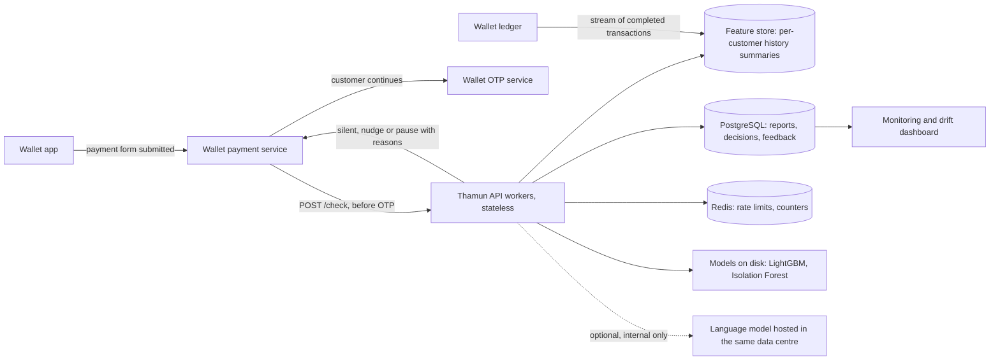

# Production architecture, scalability and monitoring

Phase 1 feedback: "does not yet show large-scale testing, real transaction load handling, or production
monitoring", "relying on in-memory report state rather than persistent database tables" and "Some parts
still use demo or session-based data, so it is not fully production-ready yet".

This page separates what runs today from what a wallet deployment would add.

## What is real and what is demo

| Part | Today | In a wallet deployment |
|---|---|---|
| Risk models, rules, explanations | Real code, the same code a deployment would run | Same |
| Scam reports, decision log, user-testing answers | SQL tables. SQLite file by default, PostgreSQL when `DATABASE_URL` is set | PostgreSQL |
| Customer history and balance | A sandbox copy of four synthetic customers per browser session, held in memory so that judges do not affect each other | Read from the wallet's own ledger and a feature store. Thamun holds no balances |
| Session token | Issued to any visitor | The wallet's customer login |
| Rate limiter, live counters | In process memory | Redis or the API gateway |
| OTP step | Accepts any four digits | The wallet's existing OTP service. Thamun never sees an OTP |

## Target architecture

Everything in the diagram sits inside the wallet provider's own network in Bangladesh.

- `POST /check` is the only call on the payment path. It takes the payment and returns a decision with
  reasons. If it fails or times out, the payment service continues to OTP as it does today. Thamun must
  never be able to stop payments by being down.
- Workers are stateless once customer history comes from the feature store, so capacity grows by adding
  workers behind a load balancer.
- The feature store holds the same running summaries that `ml/features.py` keeps in `CustomerState`:
  counts and amounts per recipient, recent payments, usual amounts by type. It is updated from the stream
  of completed transactions, not on the payment path.

## Database schema

Implemented (`api/db.py`, created automatically on start):

| Table | Columns | Notes |
|---|---|---|
| `scam_reports` | id, number, reporter (keyed hash), session (keyed hash), pattern, source, reported_on, created_at | Unique on (number, reporter): one report per customer per number |
| `audit_logs` | id, created_at, event, session (keyed hash), customer_id, payment_type, amount, decision, risk, reasons, outcome | No recipient number. Feeds the Impact tab |
| `ux_feedback` | id, created_at, session (keyed hash), scenario, decision, lang, four answers, preferred_lang, comment | Session hash is never exported |

Planned for a wallet deployment (not implemented, because the prototype has no real customers):

| Table | Purpose |
|---|---|
| `customer_features` | Running per-customer summaries (the feature store), keyed by the wallet's customer id |
| `detected_bills` | Recurring bills found per customer, with next due date and usual amount |
| `goals` | Savings goals and progress |
| `nudge_history` | Which nudges were shown, so weekly caps hold across devices |
| `model_registry` | Model version, training data window, thresholds, approval, rollback pointer |

## Scalability: what was measured

`python -m loadtest.run` drives the API with Locust. Each simulated user opens a session and repeats a
mix of risk checks, payments, home loads and number checks with 0.5 to 1.5 seconds between actions.
Results are written to `api/evidence/load_test.json` and shown in the System tab.

| Simultaneous users | Requests a second | Risk check median | 95th percentile | 99th percentile | Failed requests |
|---|---|---|---|---|---|
| 25 | 40.8 | 18 ms | 63 ms | 190 ms | 0 |
| 50 | 77.0 | 41 ms | 300 ms | 480 ms | 0 |
| 100 | 81.6 | 570 ms | 1700 ms | 2300 ms | 0 |
| 200 | 53.7 | 1600 ms | 11000 ms | 12000 ms | 0 |

Measured on one machine with 2 CPU cores (Linux), API and load generator on the same machine, 1 API worker, SQLite. Rate limits were raised for this run because every simulated user comes from one address. Sessions kept in memory: 400.

In a first run with the default limits, the limiter rejected 3,315 requests from the single load-generator address with status 429, which is the intended behaviour.

What this does and does not show:

- It is one API worker on one small machine, with the load generator on the same machine. It is a
  measurement of the code, not of a production cluster.
- The most expensive step in a check is the Isolation Forest (see `docs/model_comparison.md`, section 1,
  "ms per payment"). LightGBM with SHAP takes a fraction of a millisecond.
- Scaling to a real wallet's volume by adding workers is the design intent. It has not been measured.
- Not yet measured: real transaction load, PostgreSQL under load, multi-worker deployment, failover.

## Monitoring

`GET /monitoring` returns live counters, shown in the System tab:

| Signal | Why it matters | Example alert rule |
|---|---|---|
| Requests, error rate, rate-limited count | Service health and abuse | Server errors above 1% for 5 minutes |
| Risk check latency, median and 95th percentile | The check sits before OTP, so it must be fast | 95th percentile above 300 ms for 5 minutes |
| Decision mix: silent, nudge, pause, purpose questions | Alert fatigue shows up here first | Pause share doubles against the 30-day average |
| Share of pauses cancelled and continued (from `audit_logs`) | Whether pauses are useful or ignored | Continue-anyway rate above 90% for a week |
| Score drift (PSI against the test month) | The model is seeing traffic unlike its training data | PSI above 0.25 |
| Database health | Reports and logs depend on it | Any failed health check |

In the prototype these counters live in the API process and reset on restart. In production they would
be exported to the provider's monitoring stack.

## Model drift and retraining plan

1. **Watch.** Weekly population stability index on the risk score and on each input feature, plus the
   share of payments scored as high risk. The reference is stored in `api/evidence/reference.json`.
2. **Label.** Fraud is confirmed days or weeks later, through complaints. Recall is tracked on a delay,
   by scam type.
3. **Investigate before retraining.** A PSI above 0.25, a doubling of the pause share, or a drop in
   delayed recall opens a review. Drift caused by a festival or a pricing change is not a model fault.
4. **Retrain.** Monthly, on a rolling window, with the same time split as today: fit, choose thresholds
   on the next month, test on the month after.
5. **Promote safely.** A new model first runs in shadow next to the current one. It is promoted only if
   it catches at least as many confirmed scams at the same false-pause budget.
6. **Roll back.** Models are files with a version. Rolling back is loading the previous file.
